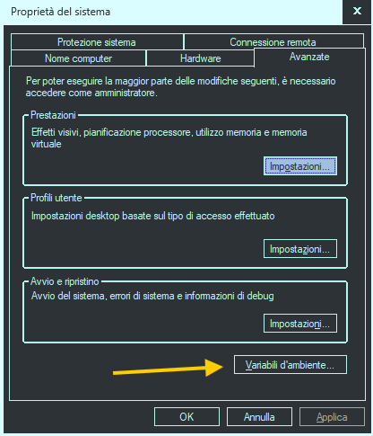
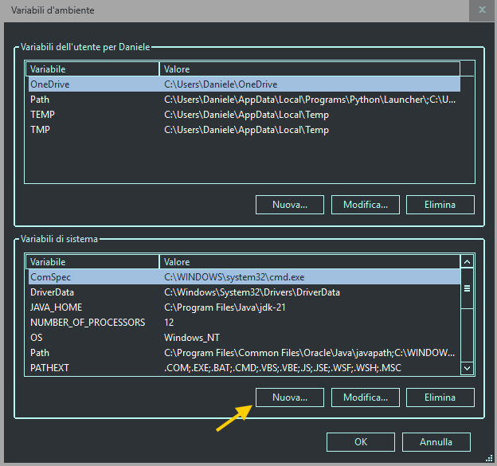
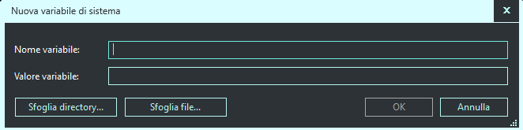
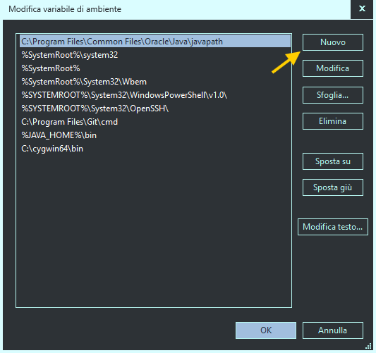
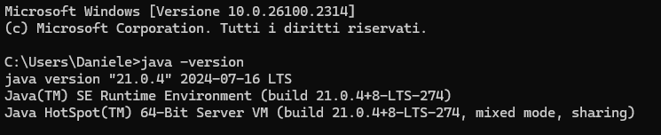
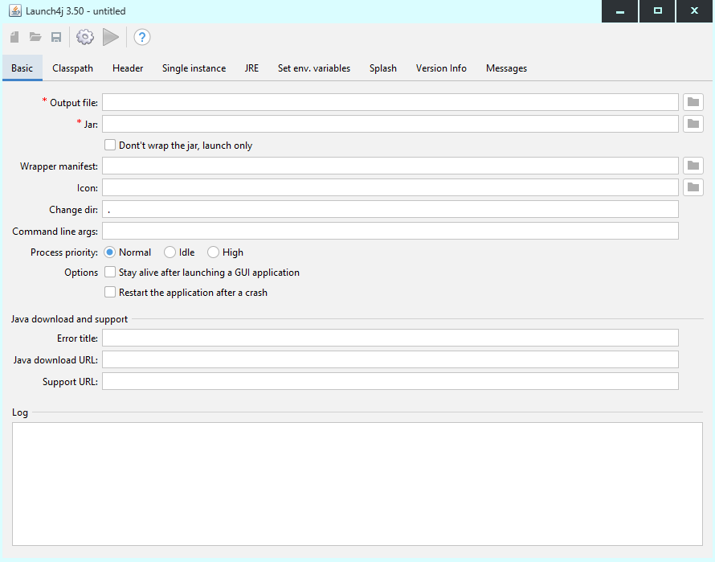
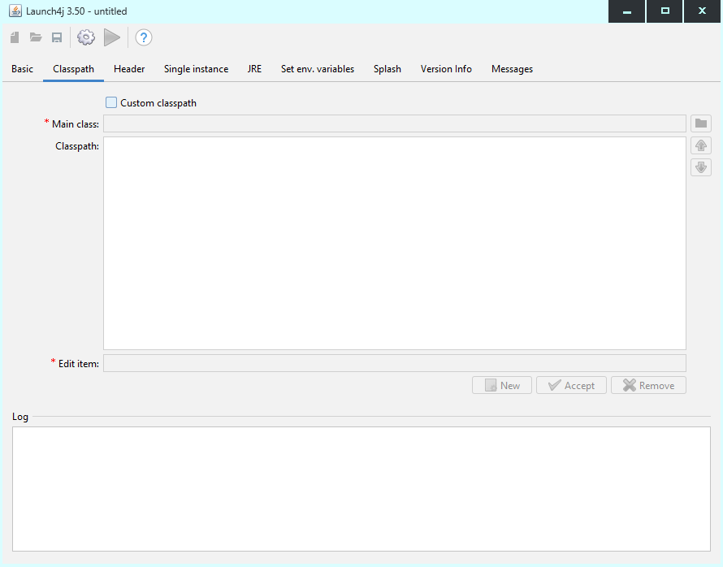
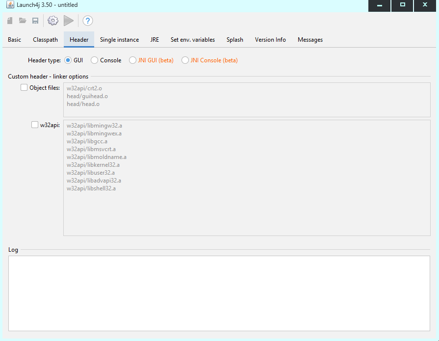
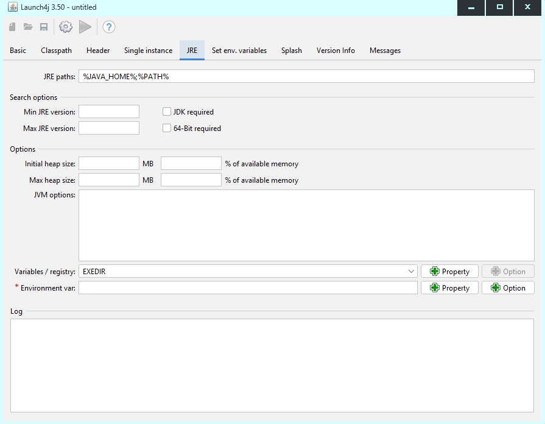

# How to convert a .jar file to an .exe file with Launch4J

## Step 1: Create a .JAR file
The **.jar** file can be created with the technologies you think best, such as *Maven, Gradle...etc*. 
 If your project uses **external dependencies**, remember to include them, this is very important for the proper functioning of your application. 
If you don't know what to do, I refer you to this guide [How to create a .jar file with Maven](https://).

## Step 2: Install Launch4J
You can easily install it at the following link: [Launch4J](https://sourceforge.net/projects/launch4j/files/launch4j-3/3.50/)

## Step 3: Install JDK and set JAVA_HOME env. variable
If you have **already** installed Java and have correctly set the *JAVA_HOME* environment variable by adding it to the system path you can move on to the next step.

> Be careful to use a version of Java that is compatible with the version used to compile your project.
*Example*. If you used version 21 to compile your project, you should have a version 21+ or equal installed on your pc.

If, on the other hand, Java is not installed on your pc, download the version you need here [Java JDK download](https://www.oracle.com/java/technologies/downloads/). Once you get the package, install it on your pc. Once the installation is complete, we must now configure the environment variable *JAVA_HOME*.

As a first step, access your pc's environment variables control panel.

<p align="center">
  
</p>
and then
<p align="center">
  
</p>
Now you should see the following window. In the Variable name field, enter JAVA_HOME. In the Variable Value field instead you must enter the path to the java installation folder, usually it is:

```
C:\Program Files\Java\jdk-{your version} 
```
Copy it, enter it, and press enter. You have now created the JAVA_HOME variable.
<p align="center">
  
</p>

The last step is to add the variable to the system path. To do this find among the system variables, the variable **path**, click it twice, you should see this window appear. 
Click on new and enter:

```
%JAVA_HOME%\bin
```

<p align="center">
  
</p>

To verify the successful setting. Open the terminal and type:
```bash
java -version
```

You should see this:

<p align="center">
  
</p>

## Step 4: Create the file .exe 

This is it! First thing we are going to open Launch4J. 
<p align="center">
  
</p>

Perfect, we are in front of the main screen. Let's start setting up our fields (*the essential ones*):

- **Output file:** define the path where the .exe file will be saved.
- **Jar:** enter the path to your .jar file that you want to convert.
- **Icon:** you can select an .ico file, this will become the icon of the generated executable.
- **Restart the application after a crash:** set true.

That's all, let's move to the **Classpath** section:

<p align="center">
  
</p>

Click on *Custom classpth* and in the field *Main class* enter the path to your .jar file.

Let's move to the **Header** section:

<p align="center">
  
</p>

If your project has GUI, then set *Header type* to GUI, otherwise set to Console.

That's all, let's move to the **JRE** section:

<p align="center">
  
</p>

This section is critical to the proper operation and deployment of the application. The JRE paths field indicates where the application should look for the JRE when it is started. It is preferable to leave the default setting so that the JRE will be found via environment variables. Obviously the pc on which the application is launched must have Java installed and properly set up. 
The application will look for the JAVA_HOME environment variable in the system path, if it is not found the application will not start.
In this section you can also set a minimum and maximum version of the JRE required for your application to work properly.

We performed the basic steps for creating an executable from an .exe file. All that remains is to generate our .exe file. To do this we click on the gear in the top menu and that's it, the .exe file will be available at the output location specified at the beginning. 